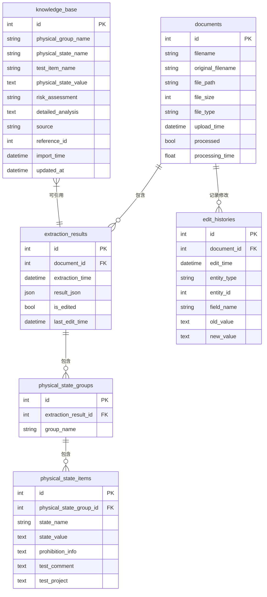

# 专业文档关键要素自动识别和提取系统 - 数据库设计说明

## 数据表结构

### 1. documents（文档表）

**作用**：存储上传的文档信息，是系统的核心数据表。

**主要字段**：

- `id`：主键，文档的唯一标识
- `filename`：系统生成的唯一文件名
- `original_filename`：原始上传的文件名
- `file_path`：文件在服务器上的存储路径
- `file_size`：文件大小（字节）
- `file_type`：文件类型（doc/docx）
- `upload_time`：上传时间
- `processed`：是否已处理标志
- `processing_time`：处理时间（秒）

**关联关系**：

- 一个文档可以有多个提取结果（extraction_results）
- 一个文档可以有多条编辑历史（edit_histories）

### 2. extraction_results（提取结果表）

**作用**：存储文档信息提取的结果，包含完整的JSON结构化数据。

**主要字段**：

- `id`：主键，提取结果的唯一标识
- `document_id`：外键，关联到documents表
- `extraction_time`：提取时间
- `result_json`：以JSON格式存储的完整提取结果
- `is_edited`：是否被编辑过的标志
- `last_edit_time`：最后编辑时间

**关联关系**：

- 属于一个文档（document）
- 可以包含多个物理状态组（physical_state_groups）

### 3. physical_state_groups（物理状态组表）

**作用**：存储提取结果中的物理状态组信息，如"封装结构"、"标识"等类别。

**主要字段**：

- `id`：主键，物理状态组的唯一标识
- `extraction_result_id`：外键，关联到extraction_results表
- `group_name`：物理状态组名称

**关联关系**：

- 属于一个提取结果（extraction_result）
- 可以包含多个物理状态项（physical_state_items）

### 4. physical_state_items（物理状态项表）

**作用**：存储具体的物理状态项，包含详细的状态名称、值和评价信息。

**主要字段**：

- `id`：主键，物理状态项的唯一标识
- `physical_state_group_id`：外键，关联到physical_state_groups表
- `state_name`：物理状态名称
- `state_value`：典型物理状态值
- `prohibition_info`：禁限用信息
- `test_comment`：测试评语
- `test_project`：试验项目

**关联关系**：

- 属于一个物理状态组（physical_state_group）

### 5. edit_histories（编辑历史表）

**作用**：记录用户对提取结果的修改历史，支持版本追踪和回溯。

**主要字段**：

- `id`：主键，编辑历史的唯一标识
- `document_id`：外键，关联到documents表
- `edit_time`：编辑时间
- `entity_type`：被编辑的实体类型（如"PhysicalStateItem"）
- `entity_id`：被编辑的实体ID
- `field_name`：被编辑的字段名
- `old_value`：修改前的值
- `new_value`：修改后的值

**关联关系**：

- 属于一个文档（document）

### 6. knowledge_base（知识库表）

**作用**：存储标准库和提取数据的物理状态信息，用于辅助提取和知识积累。

**主要字段**：

- `id`：主键，知识条目的唯一标识
- `physical_group_name`：物理状态组名称
- `physical_state_name`：物理状态名称
- `test_item_name`：试验项目名称
- `physical_state_value`：物理状态值
- `risk_assessment`：风险评价（可用/限用/禁用）
- `detailed_analysis`：详细分析/测试评语
- `source`：数据来源（'standard'或'extraction'）
- `reference_id`：引用ID
- `import_time`：导入时间
- `updated_at`：更新时间

**索引设计**：

- 单独索引：`physical_group_name`、`physical_state_name`、`test_item_name`、`source`
- 组合索引：`(physical_group_name, physical_state_name)`

## 数据库关系图

## 主要数据流程

1. 文档上传后保存到`documents`表
2. 文档处理后的结果保存到`extraction_results`表
3. 结构化数据分别保存到`physical_state_groups`和`physical_state_items`表
4. 用户编辑时记录到`edit_histories`表
5. 确认的数据可选择性导入到`knowledge_base`表作为知识积累