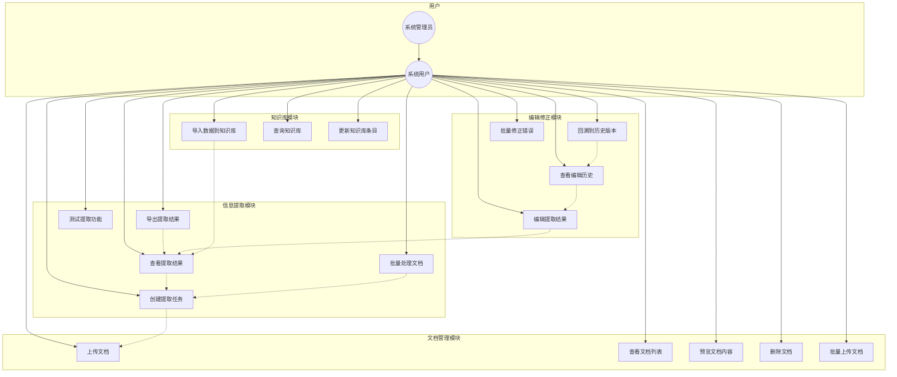
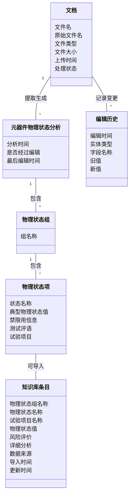
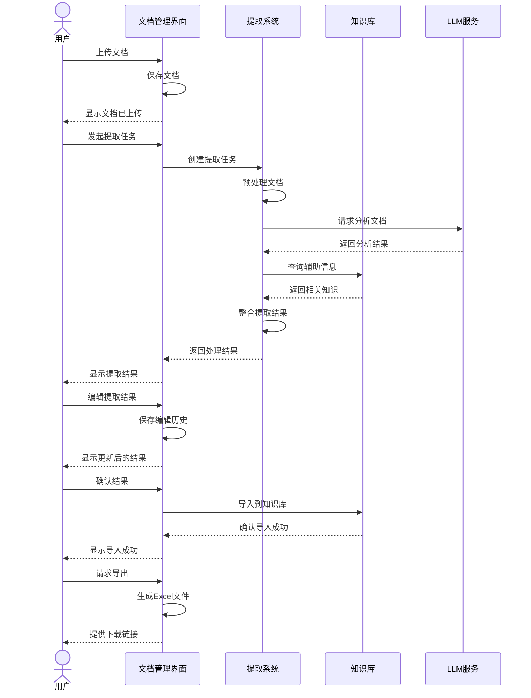
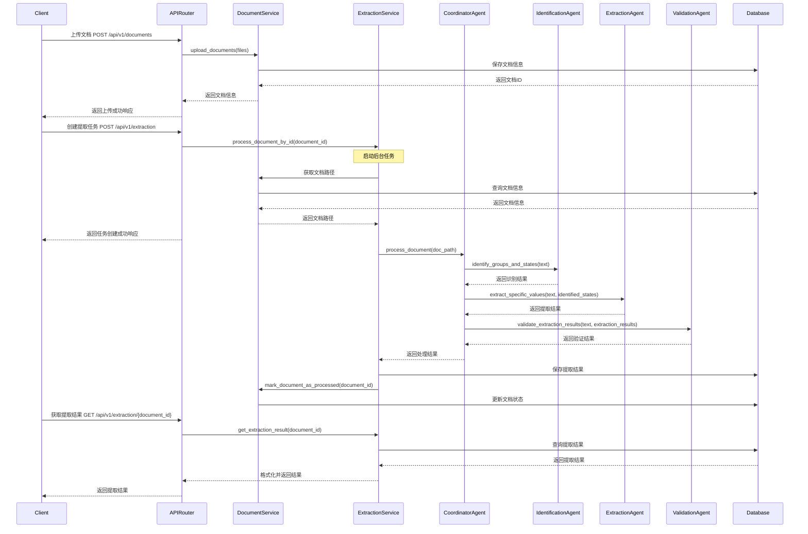

# UML图

## 用例图

```mermaid
graph TD
    subgraph 用户
        User((系统用户))
        Admin((系统管理员))
    end
    
    subgraph 文档管理模块
        UC1[上传文档]
        UC2[查看文档列表]
        UC3[预览文档内容]
        UC4[删除文档]
        UC5[批量上传文档]
    end
    
    subgraph 信息提取模块
        UC6[创建提取任务]
        UC7[查看提取结果]
        UC8[批量处理文档]
        UC9[导出提取结果]
        UC10[测试提取功能]
    end
    
    subgraph 编辑修正模块
        UC11[编辑提取结果]
        UC12[查看编辑历史]
        UC13[回溯到历史版本]
        UC14[批量修正错误]
    end
    
    subgraph 知识库模块
        UC15[导入数据到知识库]
        UC16[查询知识库]
        UC17[更新知识库条目]
    end

    User --> UC1
    User --> UC2
    User --> UC3
    User --> UC4
    User --> UC5
    User --> UC6
    User --> UC7
    User --> UC8
    User --> UC9
    User --> UC10
    User --> UC11
    User --> UC12
    User --> UC13
    User --> UC14
    User --> UC15
    User --> UC16
    User --> UC17
    
    Admin --> User
    
    %% 用例之间的关系
    UC6 -.-> UC1
    UC7 -.-> UC6
    UC8 -.-> UC6
    UC9 -.-> UC7
    UC11 -.-> UC7
    UC12 -.-> UC11
    UC13 -.-> UC12
    UC15 -.-> UC7
```

## 业务需求概念类图

```mermaid
classDiagram
    class 文档 {
        文件名
        原始文件名
        文件类型
        文件大小
        上传时间
        处理状态
    }

class 元器件物理状态分析 {
    分析时间
    是否经过编辑
    最后编辑时间
}

class 物理状态组 {
    组名称
}

class 物理状态项 {
    状态名称
    典型物理状态值
    禁限用信息
    测试评语
    试验项目
}

class 编辑历史 {
    编辑时间
    实体类型
    字段名称
    旧值
    新值
}

class 知识库条目 {
    物理状态组名称
    物理状态名称
    试验项目名称
    物理状态值
    风险评价
    详细分析
    数据来源
    导入时间
    更新时间
}

文档 "1" -- "*" 元器件物理状态分析 : 提取生成
文档 "1" -- "*" 编辑历史 : 记录变更
元器件物理状态分析 "1" -- "*" 物理状态组 : 包含
物理状态组 "1" -- "*" 物理状态项 : 包含
物理状态项 -- 知识库条目 : 可导入
```

## 系统交互图

```mermaid
sequenceDiagram
    actor 用户
    participant 文档管理界面
    participant 提取系统
    participant 知识库
    participant LLM服务
    
    用户->>文档管理界面: 上传文档
    文档管理界面->>文档管理界面: 保存文档
    文档管理界面-->>用户: 显示文档已上传
    
    用户->>文档管理界面: 发起提取任务
    文档管理界面->>提取系统: 创建提取任务
    提取系统->>提取系统: 预处理文档
    提取系统->>LLM服务: 请求分析文档
    LLM服务-->>提取系统: 返回分析结果
    提取系统->>知识库: 查询辅助信息
    知识库-->>提取系统: 返回相关知识
    提取系统->>提取系统: 整合提取结果
    提取系统-->>文档管理界面: 返回处理结果
    文档管理界面-->>用户: 显示提取结果
    
    用户->>文档管理界面: 编辑提取结果
    文档管理界面->>文档管理界面: 保存编辑历史
    文档管理界面-->>用户: 显示更新后的结果
    
    用户->>文档管理界面: 确认结果
    文档管理界面->>知识库: 导入到知识库
    知识库-->>文档管理界面: 确认导入成功
    文档管理界面-->>用户: 显示导入成功
    
    用户->>文档管理界面: 请求导出
    文档管理界面->>文档管理界面: 生成Excel文件
    文档管理界面-->>用户: 提供下载链接
```

## 文档处理序列图

```mermaid
sequenceDiagram
    participant Client
    participant APIRouter
    participant DocumentService
    participant ExtractionService
    participant CoordinatorAgent
    participant IdentificationAgent
    participant ExtractionAgent
    participant ValidationAgent
    participant Database
    
    Client->>APIRouter: 上传文档 POST /api/v1/documents
    APIRouter->>DocumentService: upload_documents(files)
    DocumentService->>Database: 保存文档信息
    Database-->>DocumentService: 返回文档ID
    DocumentService-->>APIRouter: 返回文档信息
    APIRouter-->>Client: 返回上传成功响应
    
    Client->>APIRouter: 创建提取任务 POST /api/v1/extraction
    APIRouter->>ExtractionService: process_document_by_id(document_id)
    Note over ExtractionService: 启动后台任务
    ExtractionService->>DocumentService: 获取文档路径
    DocumentService->>Database: 查询文档信息
    Database-->>DocumentService: 返回文档信息
    DocumentService-->>ExtractionService: 返回文档路径
    APIRouter-->>Client: 返回任务创建成功响应
    
    ExtractionService->>CoordinatorAgent: process_document(doc_path)
    CoordinatorAgent->>IdentificationAgent: identify_groups_and_states(text)
    IdentificationAgent-->>CoordinatorAgent: 返回识别结果
    
    CoordinatorAgent->>ExtractionAgent: extract_specific_values(text, identified_states)
    ExtractionAgent-->>CoordinatorAgent: 返回提取结果
    
    CoordinatorAgent->>ValidationAgent: validate_extraction_results(text, extraction_results)
    ValidationAgent-->>CoordinatorAgent: 返回验证结果
    
    CoordinatorAgent-->>ExtractionService: 返回处理结果
    ExtractionService->>Database: 保存提取结果
    ExtractionService->>DocumentService: mark_document_as_processed(document_id)
    DocumentService->>Database: 更新文档状态
    
    Client->>APIRouter: 获取提取结果 GET /api/v1/extraction/{document_id}
    APIRouter->>ExtractionService: get_extraction_result(document_id)
    ExtractionService->>Database: 查询提取结果
    Database-->>ExtractionService: 返回提取结果
    ExtractionService-->>APIRouter: 格式化并返回结果
    APIRouter-->>Client: 返回提取结果
```

